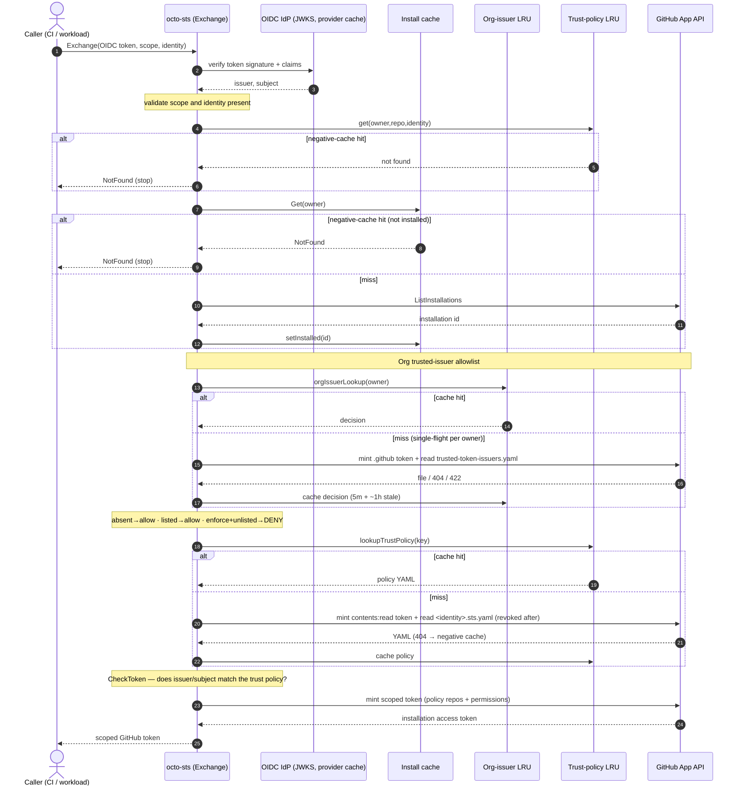
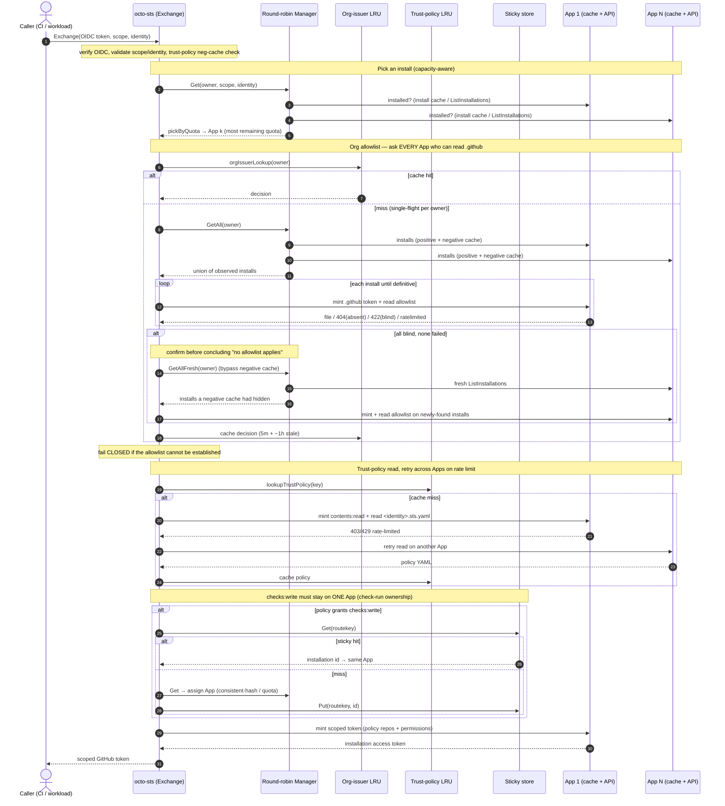

# octo-sts architecture: token-exchange sequence

How a token exchange flows through octo-sts, including the important calls and
every cache it touches, for both a single-App deployment and a multi-App
deployment (several GitHub Apps sharing load behind a round-robin manager).

The diagrams reflect the exchange path in `pkg/octosts` (`Exchange` →
`lookupInstallAndTrustPolicy` → `checkOrgTrustedIssuers` → `lookupTrustPolicy` →
`getExchangeInstall` → mint) and the installation manager in `pkg/ghinstall`.

## Caches

| Cache | Key → value | TTL | Purpose |
|---|---|---|---|
| **Install cache** (per App, `pkg/ghinstall`) | positive: owner → installation id · negative: owner → "not installed" | positive: none · negative: ~5 min | avoid a `ListInstallations` walk on every call |
| **Org-issuer LRU** (`pkg/octosts`, + single-flight) | owner → allowlist decision | 5 min fresh · ~1 h stale | avoid re-reading the org allowlist per exchange |
| **Trust-policy LRU** (`pkg/octosts`) | (owner, repo, identity) → policy YAML (and a negative entry) | LRU, with a stale-on-rate-limit fallback | avoid re-reading `.sts.yaml` per exchange |
| **Sticky store** (Firestore or in-memory) | route key → installation id | ~1 h | pin a `checks:write` identity to one App so check-run ownership is stable |

## Single application instance

## Multiple application instances (round-robin over N Apps)

The OIDC verify, `CheckToken`, and final mint are identical to the single-App
flow. The differences are App selection, cross-App enumeration for the allowlist,
cross-App retry, and sticky routing.

## Single vs multiple: the differences that matter

- **Install selection.** Single: the one App, or `NotFound`. Multi: `pickByQuota`
  selects the App with the most remaining rate-limit quota.
- **Allowlist enumeration.** Single walks one App. Multi must walk **every** App
  via `GetAll`, and confirms a "no allowlist applies" verdict with `GetAllFresh`,
  which bypasses the negative install cache. Without that confirmation, an App
  installed to turn enforcement on could be hidden by the negative cache and flip
  an enforcing org to allow-all. The per-owner single-flight keeps a cold-cache
  burst from stampeding this enumeration.
- **Rate-limit resilience.** Multi retries the trust-policy read on a different
  App when one is rate-limited; single cannot.
- **`checks:write` routing.** Only meaningful with multiple Apps: GitHub lets only
  the App that created a check run update it, so the sticky store pins the identity
  to one App across exchanges.
- **Fail-closed posture.** In enforce mode, if the allowlist cannot be established
  (errors, incomplete enumeration), the exchange is denied rather than allowed.
